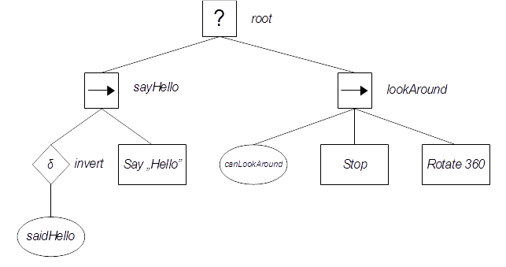
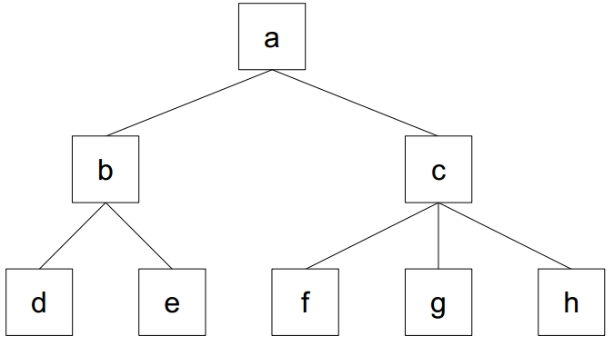

## What's this project?

This is C++ implementation of behavior trees [BT] AI system. It has no dependencies, except unit tests part where I've used [Catch](https://github.com/catchorg/Catch2) library. This project is written in C++14 standard.

More about BT concept you can find in [Doctoral Thesis "Behavior Trees in Robotics" by Michele Colledanchise](https://www.diva-portal.org/smash/get/diva2:1078940/FULLTEXT01.pdf).

## How does it work?

It defines basic types of nodes used in behavior trees, like composites (selector and sequence), decorators (link, inversion, loop) and primitives (action and condition).

To provide uniform interface there is implemented `BehaviorTree` class, which is an manager for raw behavior nodes.

At first you have to create instance of `BehaviorTree` class and fill it with behavior nodes. Then you can call `evaluate()` method on it and check tree's status, probably in some periodic way.

For more please look at the [example](##an-example) section.

## Structure of project

Code of the BT system is located in *behavior_system* directory.
There is also *external* directory, which contains [Catch](https://github.com/catchorg/Catch2) library header.
Last part of repository is *unit_tests* directory which contains unit tests of the BT system.

Behavior system is main part of project: it contains definitions of nodes and tree structure. 

Class `IBehavior` [source: [[1]](./behavior_system/IBehavior.hpp) [[2]](./behavior_system/IBehavior.cpp)] is a base class for all behavior nodes:
1. `BehaviorEmpty` - this is nothing more than it's called. :) [source: [[1]](./behavior_system/BehaviorEmpty.hpp) [[2]](./behavior_system/BehaviorEmpty.cpp)],
1. `BehaviorSelector` - [source: [[1]](./behavior_system/composite/BehaviorSelector.hpp) [[2]](./behavior_system/composite/BehaviorSelector.cpp)],
1. `BehaviorSequence` - [source: [[1]](./behavior_system/composite/BehaviorSequence.hpp) [[2]](./behavior_system/composite/BehaviorSequence.cpp)],
1. `BehaviorAction` - [source: [[1]](./behavior_system/primitive/BehaviorAction.hpp) [[2]](./behavior_system/primitive/BehaviorAction.cpp)],
1. `BehaviorCondition` - [source: [[1]](./behavior_system/primitive/BehaviorCondition.hpp) [[2]](./behavior_system/primitive/BehaviorCondition.cpp)],
1. `DecoratorInvert` - [source: [[1]](./behavior_system/decorator/DecoratorInvert.hpp) [[2]](./behavior_system/decorator/DecoratorInvert.cpp)],
1. `DecoratorLoop` - [source: [[1]](./behavior_system/decorator/DecoratorLoop.hpp) [[2]](./behavior_system/decorator/DecoratorLoop.cpp)],
1. `DecoratorLink` - [source: [[1]](./behavior_system/decorator/DecoratorLink.hpp) [[2]](./behavior_system/decorator/DecoratorLink.cpp)],
1. `DecoratorMaxNTries` - [source: [[1]](./behavior_system/decorator/DecoratorMaxNTries.hpp) [[2]](./behavior_system/decorator/DecoratorMaxNTries.cpp)].

`BehaviorTree` class is implemented in *behavior_system/tree* directory [source: [[1]](./behavior_system/tree/BehaviorTree.hpp) [[2]](./behavior_system/tree/BehaviorTree.cpp)].

BT system is prepared for use with an graphical editor, necessary data for rendering an tree are stored in _EditorMetadata_ files [[[1]](./behavior_system/EditorMetadata.hpp) [[2]](./behavior_system/EditorMetadata.cpp)]. The source code of editor should appears on my GH in close future. :) 

## How to use this code?

To make use of this project just import *behavior_system* directory ito your own project.
To use `BehaviorTree` class, include *behavior_system/tree/BehaviorTree.hpp* file. 

Basic idea is simple:
1. create `BehaviorTree` object,
1. fill `BehaviorTree` with nodes:
   1. add root node,
   1. add children to root node,
   1. change active node to another one,
   1. add children nodes,
   1. change active node to another one,
   1. ...
1. send evaluation signal to `BehaviorTree` object - behavior tree nodes will be now evaluated,
1. check return status of evaluated tree,
1. send another evaluation signal,
1. check return status,
1. ...  

For more please look at the [example](##an-example) section.

To make your own behavior node type:
* Create class with `IBehavior` class as a base.
* Override `BehaviorState internal_evaluate(id_t id)` method with designed behavior.
  > Parameter `id_t id` points to particular child to evaluation (it's an index for `IBehavior::ptr get_child_for_eval(id_t id)` method).
  
* [optional] Override others virtual methods, for example `bool can_have_children()`.
* Extend the `BehaviorTree` class by `bool add_my_new_fancy_behavior_node(some_optional parameters_if_needed)`.
 
## Who will use this project?

Everyone who needs behavior trees' based AI system. :) Project is distributed under [MIT license](https://opensource.org/licenses/MIT).

## What is the purpose of this project?

This project was designed as a part of my BSc thesis - "The control system of an autonomous mobile robot based on behavioral tree". The robot runs on ARM Cortex processor so in the code you can find parts designed for ARM architecture, but whole system is fully portable - source code is completely compatible with ISO C++14 standard. The main goal in the implementation was portability - you can use the system in embedded environment or in PC game for example.

## Todo

* *Parallel* node is nice to have feature.
* Maybe get rid of the inheritance model for behavior nodes and _templatize_ them?
* There is need to keep some data which could be shared between nodes in a tree.
  > some kind of dictionary (ID and value)?
 


And a bit trivial things to do:
* Add a namespace for project classes.
* Add a bit more friendly to remember header for including `BehaviorTree` interface. 

##An example

_[complete example is located in [main.cpp](./main.cpp) file]_

Let assume that we want to create behavior tree like this one:



We have designed our tree for simple behavior: actor has to say "hello" once and then it should look around. 

Let assume that we have some class where `saidHello` is an bool member variable, `canLookAround` is some method which checks whether actor could looks around or not and we've prepared our actor for doing all of the stuff described in action nodes, like `Stop` or `Say`, etc.. Simple dummy class `Actor` satisfies those assumptions:

```C++
class Actor
{
public:
    Actor(): said_hello{false},
             rotating{false}
    {
    }

    void say_hello()
    {
        std::cout << "Hello!\n";
        said_hello = true;
    }

    bool can_look_around()
    {
        static int look_around_counter = 0;
        constexpr int look_around_limiter = 5;

        if(look_around_counter >= look_around_limiter)
        {
            return false;
        }

        ++look_around_counter;
        return true;
    }

    bool is_stopped()
    {
        static int stopped_counter = 0;
        ++stopped_counter;

        if(stopped_counter % 3 == 0) // 2/3 of checks will fail
        {
            return true;
        }
        return false;
    }

    void stop()
    {
    }

    bool is_still_rotating()
    {
        static int rotate_counter = 0;
        if(!rotating)
        {
            return false;
        }

        ++rotate_counter;

        if(rotate_counter % 5 == 0) // 4/5 of checks will confirm that actor is rotating
        {
            return false;
        }
        return true;
    }

    void rotate(int degrees)
    {
        if(rotating)
        {
            return;
        }
        rotating = true;
        std::cout << "I'll turn " << degrees << " degrees!\n";
    }

    bool said_hello;

private:
    bool rotating;
};
```  
Lets create an instance of the `Actor` class:

```C++
Actor hero;
```

At first you have to create an object of `BehaviorTree` class. It internally stores collection of behavior nodes and points to one of them. Pointed node is called "active node". 

At this stage the collection is empty. 
You have to add root node to tree. 

Usually the root node is one of the composite nodes: a selector or a sequence - because they can be parents of many children nodes. 
In the example picture the root node is type of selector:

```C++
BehaviorTree example_tree;
example_tree.add_selector(); // root
```
   
After creation of the root node, `BehaviorTree` automatically makes root active node. Now you can add children to root **(beware: after adding any child except root, `BehaviorTree` WILL NOT automatically make it's active - this works only for root node!)**: 

```C++
example_tree.add_sequence(); // sayHello
example_tree.add_sequence(); // lookAround
```  

Now we have all of explicit root's children. Let's make "sayHello" node complete. First of all we have to make it as active.

> #### Making node active
>
> To accomplish this task we can use two methods:
> * `bool set_at_absolutely(ID id, ID id, ...)`
>    
>   This method choose active node as relative to root node. You can treat the parameter list as a path to wanted node. An ID is a zero-based index of children. Each subsequent identifier refers to the next level lower in the hierarchy. If you write `tree.set_at_absolutely(1, 3);`, you set as active fourth child of second child of root - if it exists method returns true, otherwise returns false and active node will not be change. Empty parameter list selects as active root node.
>   
> * `bool set_at_relatively(ID id, ID id, ...)`
>
>   This method choose active node as relative to currently active one. All the rules remain unchanged. Empty parameter list means "set as active node that node which is currently active", so it does not make any change. :)
>   
> As an short example please look at the picture below:
>
> 
> 
> Assume than active node is `c` (in each example below always `c` is currently active) and we've called:
> * `set_at_relatively(2)`: now active is `h` node, return value is `true`.
> * `set_at_relatively()`: still active is `c` node, return value is `true`.
> * `set_at_relatively(2, 0)`: still active is `c` node, return value is `false`.
> * `set_at_absolutely()`: now active is root node `a`, return value is `true`.
> * `set_at_absolutely(0, 1)`: now active is `e` node, return value is `true`.
> * `set_at_absolutely(2)`: still active is `c` node, return value is `false`.

 
```C++
// set active node: first (zero-based indexing) child of root:
example_tree.set_at_absolutely(0); 
```

Now we want to add inversion node, "saidHello" condition node and then action node in which we actually say "Hello". 

Method `add_condition` takes as parameter `std::function<bool()>`, so we can pass to this function for example a lambda expression.

Similarly looks method `add_action` with the difference, that the type of return value of an needed functor is `BehaviorState` object.

The code of left part our example_tree might looks like this:

```C++
example_tree.add_invert();

// go to first child of invert decorator node:
example_tree.set_at_relatively(0);

// saidHello condition node:
example_tree.add_condition([&hero]()
                           {
                               return hero.said_hello;
                           });

```

> `BehaviorState` type is an strongly typed enum with 4 values: `BehaviorState::success`, `BehaviorState::failure`,`BehaviorState::running` and `BehaviorState::undefined`. Last state, undefined, is reserved for internal use and it should be never explicit returned as a result from any action node.

Now, when we know basic rules, lets create right part of `example_tree`:

```C++
// set as active 'lookAround' sequence:
example_tree.set_at_absolutely(1);

// canLookAround condition node:
example_tree.add_condition([&hero]()
                           {
                               return hero.can_look_around();
                           });

// Stop action node:
example_tree.add_action([&hero]()
                        {
                            if(hero.is_stopped())
                            {
                                return BehaviorState::success;
                            }
                            hero.stop();
                            return BehaviorState::running;
                        });

// Rotate360 action:
example_tree.add_action([&hero]()
                        {
                            hero.rotate(360);
                            if(hero.is_still_rotating())
                            {
                                return BehaviorState::running;
                            }
                            return BehaviorState::success;
                        });
```
We've just prepared simple behavior tree. Now we have to evaluate it in order to get use from BT system.

```C++
// If we want to evaluate whole tree, we have to set root node as active:
example_tree.set_at_absolutely();

for(int i = 0; i < 50; ++i)
{
    std::cout << i << " iteration\n";

    auto state = example_tree.evaluate();

    std::cout << "- returned state: ";
    switch(state)
    {
        case BehaviorState::failure:
            std::cout << "failure";
            break;
        case BehaviorState::running:
            std::cout << "running";
            break;
        case BehaviorState::success:
            std::cout << "success";
            break;
        case BehaviorState::undefined:
            std::cout << "undefined";
            break;
    }
    std::cout << "\n---\n";
}
```

All source code of this example you can find in [main.cpp](./main.cpp).
      

