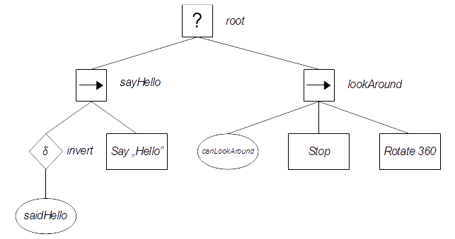
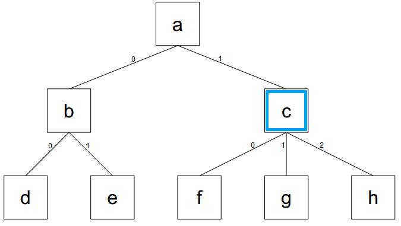

## What's this project?

This is C++ implementation of behavior trees [BT] AI system. It has no dependencies, except unit tests part where I've used [Catch](https://github.com/catchorg/Catch2) library. This project is written in C++14 standard.

More about BT concept you can find in [Doctoral Thesis "Behavior Trees in Robotics" by Michele Colledanchise](https://www.diva-portal.org/smash/get/diva2:1078940/FULLTEXT01.pdf).

## How does it work?

It defines basic types of nodes used in behavior trees, like composites (selector and sequence), decorators (link, inversion, loop) and primitives (action and condition).
To provide resource-safe interface exists `BehaviorTree` class, which is kind of manager for raw behavior nodes.
At first you have to create instance of `BehaviorTree` class and full it with behavior nodes. Then you can call `evaluate()` method on it and check tree's status, probably in some periodic way. 

Code of the BT system is located in 'behavior_system' directory.
There is also 'external' directory, which contains [Catch](https://github.com/catchorg/Catch2) library header.
Last part of repository is 'unit_tests' directory which contains unit tests of the BT system.

## How to use this code?

Basic idea is simple:
1. create `BehaviorTree` object,
1. fulfill `BehaviorTree` with nodes:
   1. add root node,
   1. add children to root node,
   1. change active node to another one,
   1. add children nodes,
   1. change active node to another one,
   1. ...
1. send evaluation signal to `BehaviorTree` object - behavior tree nodes will be now evaluated,
1. check return status of evaluated tree,
1. send another evaluation signal,
1. check return status,
1. ...  
  

## An example

Lets assume than we want to create behavior tree like this one:



We have designed our tree for simple behavior: actor has to say "hello" once and then it should look around. 

Let assume that `saidHello` is an bool variable, `canLookAround` is some method which checks whether actor could looks around or not and we've prepared our actor for doing all of the stuff described in action nodes, like `Stop` or `Say`, etc.. 

At first you have to create an object of `BehaviorTree` class. It internally stores collection of behavior nodes and points to one of them. Pointed node is called "active node". 

At this stage the collection is empty. 
You have to add root node to tree. 
Usually the root node is one of the composite nodes: a selector or a sequence - because they can be parents of many children nodes. 
In the example picture the root node is type of selector:

```C++
BehaviorTree example_tree;
example_tree.add_selector(); // root
```
   
After creation of the root node, `BehaviorTree` automatically makes root active node. Now you can add children to root (beware: after adding any child except root, `BehaviorTree` WILL NOT automatically make it's active - this works only for root node!): 

```C++
example_tree.add_sequence(); // sayHello
example_tree.add_sequence(); // lookAround
```  

Now we have all of explicit root's children. Let's make "sayHello" node complete. First of all we have to make it's as active (for guidance look at [this](sfd)). 
 
```C++
// set active node: first (zero-based indexing) child of root:
example.set_at_absolutely(0); 
```

Now we want to add inversion node, "saidHello" condition node and then action node in which we actually say "Hello". 

Method `add_condition` takes as parameter `std::function<bool()>`, so we can pass to this function for example a lambda.
Similarly looks method `add_action` with the difference, that the type of return value of an needed functor is `BehaviorState` object.

Lets assume than we have boolean variable called saidHello somewhere in available scope. The code of left part our example_tree might looks like this:

```C++
Actor hero;

example.add_inversion();

// saidHello condition node:
example.add_condition([&hero]() 
                      {
                            return hero.said_hello();
                      });

// say "Hello" action node:                        
example.add_action([&hero]() 
                   {                        
                        hero.say_hello();
                        return BehaviorState::success;
                   });
```

`BehaviorState` type is an strongly typed enum with 4 values: `BehaviorState::success`, `BehaviorState::failure`,`BehaviorState::running` and `BehaviorState::undefined`. Last state, undefined, is reserved for internal use and it should be never explicit returned as a result from any action node.

Now, when we know basic rules, lets create right part of `example_tree`:

```C++
Actor hero;
// ...

example_tree.set_at_absolutely(1); // set as active 'lookAround' sequence
example_tree.add_condition([&hero]()
                           {
                                return hero.can_look_around();
                           });
                           
example_tree.add_action([&hero]()
                        {
                            if(hero.is_stopped())
                            {
                                return BehaviorState::success;
                            }
                            hero.stop();
                            return BehaviorState::running;
                        });
example_tree.add_action([&hero]()
                        {
                            if(hero.is_still_rotating())
                            {
                                return BehaviorState::running;
                            }
                            if(hero.has_ended_rotating())
                            {
                                return BehaviorState::success; 
                            }
                            hero.rotate(360);
                            return BehaviorState::running;                             
                        });
```
We've just prepared simple behavior tree. Now we have to evaluate it to get use from behavior trees system.

All source code of this example:

      
## Making active

To accomplish this task we can use two methods:
* `bool set_at_absolutely(ID id, ID id, ...)`
    
   This method choose active node as relative to root node. You can treat the parameter list as a path to wanted node. An ID is a zero-based index of children. Each subsequent identifier refers to the next level lower in the hierarchy. If you write `tree.set_at_absolutely(1, 3);`, you set as active fourth child of second child of root - if it exists method returns true, otherwise returns false and active node will not be change. Empty parameter list selects as active root node.
   
* `bool set_at_relatively(ID id, ID id, ...)`

   This method choose active node as relative to currently active one. All the rules remain unchanged. Empty parameter list means "set as active node that node which is currently active", so it does not make any change. :)
   
As an short example please look at the picture below:



Assume than active node is `c` (in each example below always `c` is currently active) and we've called:
* `set_at_relatively(2)`: now active is `h` node, return value is `true`.
* `set_at_relatively()`: still active is `c` node, return value is `true`.
* `set_at_relatively(2, 0)`: still active is `c` node, return value is `false`.
* `set_at_absolutely()`: now active is root node `a`, return value is `true`.
* `set_at_absolutely(0, 1)`: now active is `e` node, return value is `true`.
* `set_at_absolutely(2)`: still active is `c` node, return value is `false`.


## Who will use this project?

Everyone who needs behavior trees based AI system. :) Project is distributed under [MIT license](https://opensource.org/licenses/MIT).

## What is the purpose of this project?

This project was designed as a part of my BSc thesis - "The control system of an autonomous mobile robot based on behavioral tree". The robot runs on ARM Cortex processor so in the code you can find parts designed for ARM architecture, but whole system is fully portable - source code is completely compatible with ISO C++14 standard. The main goal in the implementation was portability - you can use the system in embedded environment or in PC game for example.

## Todo

There is need to keep some data which could be shared between nodes in a tree [some kind of dictionary (ID and value)?].

'Parallel' node is nice to have feature. 